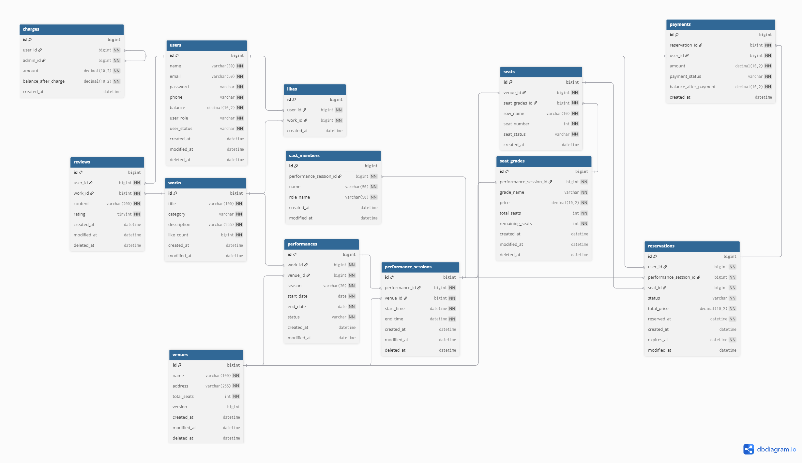

# 🎭 공연 예매 서비스 (Performance Booking Service)

> 문화예술 공연을 검색하고 예매할 수 있는 결제 통합 서비스입니다.

---

## 📌 프로젝트 개요

| 항목 | 내용                      |
|------|-------------------------|
| 프로젝트명 | Ticketing Project       |
| 개발 기간 | 2026.03.05 ~ 2025.03.25 |
| 개발 인원 | 5명                      |
| 데이터베이스 | MySQL 8.0               |
| 아키텍처 | Monolithic REST API     |

---

## 👥 팀원 소개

| 이름  | 역할 | 담당 기능        | Github        |
|-----|------|--------------|-----------------|
| 김세현 | 팀장 | 배포 + CI/CD   | https://github.com/ginsengcandy|
| 윤민기 | 팀원 | 실시간 채팅 + 인프라 | https://github.com/minky5004|
| 김규범 | 팀원 | 인덱스          | https://github.com/gb96-dev|
| 이준연 | 팀원 | 캐시           |https://github.com/LeeJun14|
| 배주원 | 팀원 | 동시성 제어       |https://github.com/bjw446|

---

## 🛠 기술 스택

| 분류         | 기술                    |
|------------|-----------------------|
| Language   | Java 17               |
| Framework  | Spring Boot 3.3.5     |
| ORM        | Spring Data JPA       |
| Database   | MySQL 8.0             |
| Security   | Spring Security, JWT  |
| Build Tool | Gradle                |
| Cache      | Redis 7.0             |
| API Docs   | RestDocs              |

---

## 📁 프로젝트 구조

```
src
└── main
    └── java
        └── example
            └── ticketingproject
                ├── auth
                │   ├── controller
                │   ├── dto
                │   ├── exception
                │   └── service
                ├── chat                    # 실시간 채팅 기능
                │   ├── config              # 웹소켓 설정
                │   ├── domain              # 채팅 비즈니스 로직 (Controller, Service, Entity 등)
                │   ├── listner             # 웹소켓 연결/해제 세션 이벤트 감지
                │   ├── pubsub              # Redis 기반 메시지 발행 및 구독 로직
                │   └── security            # STOMP 통신 JWT 인증 및 권한 인터셉터
                ├── common
                │   ├── config
                │   ├── dto
                │   ├── entity
                │   ├── enums
                │   └── exception
                ├── domain
                │   ├── cashcharge          # 캐시 충전
                │   ├── castmember          # 캐스팅 멤버
                │   ├── like                # 찜
                │   ├── payment             # 결제
                │   ├── performance         # 공연
                │   ├── performancesession  # 공연 회차
                │   ├── reservation         # 예약
                │   ├── review              # 리뷰
                │   ├── seat                # 좌석
                │   ├── seatgrade           # 좌석 등급
                │   ├── user                # 유저
                │   ├── venue               # 장소
                │   └── work                # 작품
                └── security
                    ├── exception
                    └── jwt
```

---

## ⚙️ ERD



---

## 🔐 권한 체계

| 역할           | 설명                        |
|--------------|---------------------------|
| `SUPERADMIN` | 슈퍼 관리자. 일반 관리자의 관리        |
| `ADMIN`      | 일반 관리자. 공연 등록, 캐시 충전 등 가능 |
| `USER`       | 일반 고객. 예매, 리뷰, 찜 가능       |

### 관리자 상태 전이
```
PENDING → ACTIVE → DELETED
(가입)   (슈퍼 관리자 승인)  (슈퍼 관리자 삭제)
```

---

## # 📡 API 명세

### 🔑 인증 `Auth`
| Method | URI | 설명 | 권한 |
| :--- | :--- | :--- | :---: |
| POST   | `/auth/admin-register` | (관리자) 회원가입 | - |
| POST | `/auth/register` | 회원가입 | - |
| POST | `/auth/login` | 로그인 | - |
| POST | `/auth/logout` | 로그아웃 | USER |
### 👥 유저 `Users`
| Method | URI | 설명 | 권한 |
|:-------| :--- | :--- | :---: |
| GET    | `/admin/users` | (관리자)유저 목록 조회 | ADMIN |
| GET    | `/users/me` | 내 정보 조회 | USER, ADMIN |
| PUT    | `/users/me` | 내 정보 수정 | USER |
| DELETE | `/users/delete` | 내 정보 삭제(탈퇴) | USER |
| POST   | `/super/admin/{adminId}` | 관리자 활성화(슈퍼 관리자) | SUPER |
| PUT    | `/super/admin/{userId}` | 유저 정보 수정(슈퍼 관리자) | SUPER |
| DELETE | `/super/admin/{userId}` | 유저 삭제(슈퍼 관리자) | SUPER |

### 🎭 작품 `Works`
| Method | URI | 설명 | 권한 |
| :--- | :--- | :--- | :---: |
| POST | `/admin/works` | 작품 생성 | ADMIN |
| PUT | `/admin/works/{workId}` | 작품 수정 | ADMIN |
| GET | `/works/{workId}` | 작품 단건 조회 | - |
| GET | `/works` | 작품 목록 조회 | - |

### 🎬 공연 `Performance`
| Method | URI | 설명 | 권한 |
| :--- | :--- | :--- | :---: |
| POST | `/admin/performances` | 공연 생성 | ADMIN |
| GET | `/performances` | 공연 목록 조회 | - |
| GET | `/performances/{performanceId}` | 공연 단건 조회 | - |
| PATCH | `/admin/performances/{performanceId}` | 공연 정보 수정 | ADMIN |
| DELETE | `/admin/performances/{performanceId}` | 공연 폐쇄 | ADMIN |

### 🗓 공연 회차 `Performance Session`
| Method | URI | 설명 | 권한 |
| :--- | :--- | :--- | :---: |
| POST | `/admin/performances/{performanceId}/sessions` | 공연 회차 생성 | ADMIN |
| GET | `/performances/{performanceId}/sessions` | 공연 회차 목록 조회 | - |
| GET | `/performances/{performanceId}/sessions/{sessionId}` | 공연 회차 단건 조회 | - |
| PATCH | `/admin/performances/{performanceId}/sessions/{sessionId}` | 공연 회차 정보 수정 | ADMIN |
| DELETE | `/admin/performances/{performanceId}/sessions/{sessionId}` | 공연 회차 삭제 | ADMIN |

### 🎟 예약 `Reservations`
| Method | URI | 설명 | 권한 |
| :--- | :--- | :--- | :---: |
| POST | `/reservations` | 예약 생성 | USER |
| GET | `/admin/reservations` | (관리자)전체 예약 목록 조회 | ADMIN |
| GET | `/admin/reservations/{userId}` | (관리자)예약 목록 조회(유저별) | ADMIN |
| GET | `/admin/reservations/{userId}/{reservationId}` | (관리자)예약 단건 조회 | ADMIN |
| GET | `/reservations/{reservationId}` | (고객) 예약 단건 조회 | USER |
| DELETE | `/reservations/{reservationId}` | 예약 상태 수정(취소) | USER |
| DELETE | `/admin/reservations/{reservationId}/{userId}` | (관리자)예약 상태 수정(취소) | ADMIN |

### 💳 결제 `Payments`
| Method | URI | 설명 | 권한 |
| :--- | :--- | :--- | :---: |
| POST | `/payments` | 결제 내역 생성 | USER |
| GET | `/payments/{paymentId}` | 결제 내역 단건 조회 | USER |
| GET | `/admin/payments/{paymentId}/{userId}` | (관리자)결제 내역 단건 조회 | ADMIN |
| GET | `/payments` | 결제 내역 목록 조회 | USER |
| GET | `/admin/payments` | (관리자)결제 내역 목록 조회 | ADMIN |

### 💰 캐시 충전 `Charges`
| Method | URI | 설명 | 권한 |
| :--- | :--- | :--- | :---: |
| POST | `/admin/charges/{userId}` | 캐시 충전 내역 생성 | ADMIN |
| GET | `/charges` | 캐시 충전 내역 조회 | USER |
| GET | `/admin/charges` | 캐시 충전 내역 조회 (관리자) | ADMIN |
| GET | `/admin/charges/{userId}` | 캐시 특정 유저 충전 내역 조회 (관리자) | ADMIN |

### 📍 장소 `Venues`
| Method | URI | 설명 | 권한 |
| :--- | :--- | :--- | :---: |
| POST | `/admin/venues` | 장소 등록 (관리자) | ADMIN |
| GET | `/venues` | 장소 목록 조회 | - |
| GET | `/venues/{venueId}` | 장소 단건 조회 | - |
| PATCH | `/admin/venues/{venueId}` | 장소 수정 | ADMIN |
| DELETE | `/admin/venues/{venueId}` | 장소 삭제 | ADMIN |

### 🎤 멤버 `Cast Members`
| Method | URI | 설명 | 권한 |
| :--- | :--- | :--- | :---: |
| POST | `/admin/performances/{perfId}/sessions/{sessId}/casts` | 멤버 등록 | ADMIN |
| GET | `/performances/{perfId}/sessions/{sessId}/casts` | 멤버 목록 조회 | - |
| PATCH | `/admin/performances/{perfId}/sessions/{sessId}/casts/{castId}` | 멤버 수정 | ADMIN |
| DELETE | `/admin/performances/{perfId}/sessions/{sessId}/casts` | 멤버 삭제 | ADMIN |

### 💺 좌석 `Seats`
| Method | URI                                         | 설명 | 권한 |
| :--- |:--------------------------------------------| :--- | :---: |
| POST | `/admin/venues/{venueId}/seats`             | 좌석 생성 | ADMIN |
| GET | `/venues/{venueId}/seats`                   | 좌석 목록 조회 | - |
| GET | `/venues/{venueId}/seats/{seatId}`          | 좌석 단건 조회 | - |
| POST | `/admin/venues/{venueId}/seats/optimistic`  | 좌석 생성(낙관적 락) | ADMIN |
| POST | `/admin/venues/{venueId}/seats/pessimistic` | 좌석 생성(비관적 락) | ADMIN |
| POST | `/admin/venues/{venueId}/seats/redisson Redisson`                           | 좌석 생성(Redisson 분산 락) | ADMIN |
| POST | `/admin/venues/{venueId}/seats/redis Lettuce`                            | 좌석 생성(Lettuce 분산 락) | ADMIN |

### 🏷 좌석 등급 `Seat Grades`
| Method | URI | 설명 | 권한 |
| :--- | :--- | :--- | :---: |
| POST | `/admin/sessions/{sessionId}/seat-grades` | 좌석 등급 생성 | ADMIN |
| GET | `/sessions/{sessionId}/seat-grades` | 좌석 등급 목록 조회 | - |
| GET | `/sessions/{sessionId}/seat-grades/{seatGradeId}` | 좌석 등급 단건 조회 | - |
| PUT | `/admin/sessions/{sessionId}/seat-grades/{seatGradeId}` | 좌석 등급 수정 | ADMIN |
| DELETE | `/admin/sessions/{sessionId}/seat-grades/{seatGradeId}` | 좌석 등급 삭제 | ADMIN |

### ⭐ 리뷰 `Reviews`
| Method | URI | 설명 | 권한 |
| :--- | :--- | :--- | :---: |
| POST | `/works/{workId}/reviews` | 리뷰 생성 | USER |
| PUT | `/works/{workId}/reviews/{reviewId}` | 리뷰 수정(본인것만) | USER |
| GET | `/works/{workId}/reviews` | 리뷰 목록 조회 | - |
| DELETE | `/works/{workId}/reviews/{reviewId}` | 내 리뷰 삭제 | USER |
| DELETE | `/admin/works/{workId}/reviews/{reviewId}` | (관리자) 리뷰 삭제 | ADMIN |

### ❤️ 찜 `Likes`
| Method | URI | 설명 | 권한 |
| :--- | :--- | :--- | :---: |
| POST | `/works/{workId}/likes` | 찜 생성 | USER |
| DELETE | `/works/{workId}/likes/{likeId}` | 찜 삭제 | USER |

### 💬 실시간 채팅 (1:1 고객 문의) `/chat`

| Method | URI | 설명                      | 권한 |
|--------|-----|-------------------------|------|
| POST | `/chat/rooms` | 문의 채팅방 생성               | USER |
| GET | `/chat/rooms` | 내 채팅방 목록 조회             | USER |
| GET | `/admin/chat/rooms` | (관리자) 전체/상태별 채팅방 목록 조회  | ADMIN |
| PATCH | `/chat/rooms/{roomId}/status` | 채팅방 상태 변경 (대기, 처리중, 완료) | ADMIN, USER |
| GET | `/chat/rooms/{roomId}/messages` | 채팅방 이전 메시지 내역 조회 (페이징) | ADMIN, USER |

**⚡ WebSocket & STOMP 통신 명세**
* **Endpoint (연결):** `ws://{host}/ws-stomp`
    * 연결 시 `Authorization` 헤더에 Bearer 토큰(JWT)이 반드시 필요합니다.
* **Subscribe (구독):** `/sub/chat/room/{roomId}`
    * 해당 채팅방의 메시지를 수신합니다.
* **Publish (발행):** `/pub/chat/send`
    * `ChatMessageRequest` DTO 형식으로 JSON 데이터를 전송합니다.

---

## 💡 핵심 기능 및 구현 전략

### 소프트 딜리트
- 고객/관리자 탈퇴 시 `deleted_at` 기록 및 `status = DELETED` 처리
- 고객 탈퇴 시 이메일·전화번호 마스킹 처리

### 예외 처리
| 예외 클래스 | 발생 조건            | HTTP 상태 |
|------------|------------------|-----------|
| `BaseExceptionHandler` | 런타임 에러           | ErrorStatus |

---

# 검색 기능 및 캐시 최적화

---

## 1️⃣ 검색 API 설계

### 검색 전략: QueryDSL 동적 쿼리 + DTO 직접 조회

| 항목 | 내용 |
|------|------|
| 동적 쿼리 | `BooleanExpression`으로 null 조건 자동 제외 |
| DTO 직접 조회 | `Projections.constructor()`로 필요한 컬럼만 SELECT |
| 페이징 | content 조회와 count 조회를 별도 메서드로 분리 |

### 검색 조건 (동적 쿼리)

| 파라미터 | 조건 | 설명 |
|----------|------|------|
| `keyword` | `work.title LIKE '%keyword%'` | 작품명 검색 |
| `category` | `work.category = category` | 장르 필터 |
| `startDate` / `endDate` | `performanceSession.startTime BETWEEN` | 공연 기간 필터 |
| `status` | `performance.status = status` | 공연 상태 필터 |

### count 쿼리 분리

**인메모리 캐시(Caffeine) 적용 시**
```java
// Page 객체를 메모리에 그대로 저장 가능
// PageableExecutionUtils로 마지막 페이지 최적화
return PageableExecutionUtils.getPage(result, pageable, countQuery::fetchOne);
// → 마지막 페이지에서 content 수가 pageSize보다 작으면 count 쿼리 실행 생략
```

**Redis 캐시 전환 후**
```java
// Page 객체는 Redis에 직렬화할 수 없어 content와 count를 분리
List<PerformanceSearchResponse> content = performanceSearchCacheService.getContent(...);
long total = performanceSearchCacheService.getCount(...);
return new PageImpl<>(content, pageable, total);
```

| 항목 | 인메모리 (Caffeine) | Redis |
|------|-------------------|-------|
| Page 저장 | 객체 그대로 저장 가능 | 직렬화 불가 → 분리 필요 |
| count 최적화 | 마지막 페이지 count 생략 | 별도 캐시로 저장/재사용 |
| count 키 | 불필요 | pageNumber 제외한 별도 키 |

**count 키에서 pageNumber를 제외한 이유**

> 전체 결과 수는 페이지 번호와 무관하게 동일한 값이므로 동일한 검색 조건이라면
> count는 한 번만 캐시에 저장되어 재사용됩니다.

---

## 2️⃣ 인기 검색어

### 구현 방식
Redis Sorted Set(ZSet)을 활용해 검색어별 score를 관리하고 상위 10개를 조회합니다.

```
# 검색 시 score 증가
ZINCRBY popular:search:performance:2025031315 1 "레미제라블"

# 상위 10개 조회
ZREVRANGE popular:search:performance:2025031315 0 9
```

### 집계 기간 - 실시간 (1시간 단위)

| 항목 | 내용 |
|------|------|
| 키 구조 | `popular:search:{domain}:{yyyyMMddHH}` |
| TTL | 1시간 (자동 만료) |
| 선택 이유 | 실시간 트렌드 반영, 테스트 환경에서 집계 결과 즉시 확인 가능 |

> **일별/주간을 선택하지 않은 이유**
> - 일별: 하루 동안의 데이터가 누적되어 새로운 트렌드 반영이 느림
> - 주간: 7일치 키를 `ZUNIONSTORE`로 합산하는 추가 로직 필요, 구현 복잡도 증가

### 중복 검색 카운팅 방지

```
키: search:dedup:{domain}:{yyyyMMddHH}:{userId}:{keyword}
TTL: 1시간
```

| 흐름 | 동작 |
|------|------|
| 첫 번째 검색 | `setIfAbsent` → true → score 증가 |
| 1시간 내 재검색 | `setIfAbsent` → false → 카운팅 제외 |
| 1시간 후 재검색 | TTL 만료 → 다시 카운팅 |

**userId 기반을 선택한 이유**
> 티켓팅 서비스 특성상 로그인이 필수입니다.
> IP 기반 방식은 NAT 환경에서 여러 사용자가 같은 IP를 공유할 경우 부정확할 수 있어 제외했습니다.

---

## 3️⃣ 검색 API 캐시 적용 (인메모리 → Redis 전환)

### 캐시를 적용한 이유

**검색 API (`performanceSearch`)**
검색 API는 동일한 조건으로 반복 호출될 가능성이 높고, LIKE 쿼리는 인덱스를 제대로 활용하지 못해 DB 부하가 큽니다.
검색 결과는 수 분 내에 급격히 변하지 않으므로 캐시 적용으로 DB 부하를 줄이고 응답 속도를 개선했습니다.

**인기 검색어 API (`popularKeywords`)**
매 요청마다 Redis를 조회하는 비용을 줄이기 위해 캐시를 적용했습니다.
인기 검색어는 실시간성이 중요하므로 TTL을 1분으로 짧게 설정했습니다.

### v1 vs v2 비교

| 항목 | v1 | v2 (인메모리) | v2 (Redis 전환 후) |
|------|----|--------------|--------------------|
| 엔드포인트 | `GET /performance/search/v1` | `GET /performance/search/v2` | `GET /performance/search/v2` |
| 캐시 적용 | ❌ | ✅ Caffeine (인메모리) | ✅ Redis (리모트 캐시) |
| 동작 방식 | 매 요청마다 DB 조회 | 캐시 HIT 시 메모리에서 즉시 반환 | 캐시 HIT 시 Redis에서 즉시 반환 |
| Scale-out | - | 서버 간 공유 불가 | 모든 서버 공유 가능 |

### 캐시 전략 - Cache-aside (Lazy Loading)

```
요청 → 캐시 확인
  ├─ HIT  → Redis 캐시에서 즉시 반환
  └─ MISS → DB 조회 → Redis에 저장 → 반환
```

> **Cache-aside를 선택한 이유**
> - 검색 API는 읽기 위주이고 데이터 변경 빈도가 낮습니다.
> - Write-through는 데이터 변경 시 캐시도 함께 갱신해야 해서 복잡도가 높아집니다.
> - Write-back은 캐시와 DB 사이의 데이터 정합성 문제가 발생할 수 있습니다.

### TTL 설정

| 캐시 | TTL | 설정 이유 |
|------|-----|----------|
| `performanceSearch` | 5분 | DB 부하 감소, 데이터 변경 빈도 낮음 |
| `popularKeywords` | 1분 | 실시간성 중요, Redis 조회 비용 절감 |

**인메모리(Caffeine) vs Redis TTL/maximumSize 비교**

| 항목 | 인메모리 (Caffeine) | Redis |
|------|-------------------|-------|
| TTL | `expireAfterWrite()` | `entryTtl()` |
| maximumSize | 설정 필요 (서버 메모리 직접 사용) | 설정 불필요 (Redis 서버가 관리) |
| 메모리 관리 | 애플리케이션 레벨에서 제한 | Redis `maxmemory-policy`로 관리 |

**maximumSize를 설정하지 않은 이유**
> 인메모리 캐시(Caffeine)는 서버 메모리를 직접 사용하므로 `maximumSize`로 항목 수를 제한해야 했습니다.
> Redis 리모트 캐시로 전환 후에는 메모리 관리를 Redis 서버가 전담하므로 `maximumSize` 설정이 불필요합니다.
> Redis 서버의 `maxmemory-policy` 설정으로 메모리 관리 정책을 지정할 수 있습니다.

### 캐시 Key 설계

```
# content 캐시
performanceSearch::search:{keyword}:{category}:{startDate}:{endDate}:{status}:{pageNumber}

# count 캐시
performanceSearch::count:{keyword}:{category}:{startDate}:{endDate}:{status}

# 실제 예시
performanceSearch::search:레미제라블:MUSICAL:ALL:ALL:ON_SALE:0
performanceSearch::count:레미제라블:MUSICAL:ALL:ALL:ON_SALE

# 인기 검색어 캐시
popularKeywords::realtime:{domain}
popularKeywords::realtime:performance
```

| 항목 | 설명 |
|------|------|
| `value` | 캐시 저장소 이름으로 캐시 종류 구분 |
| `key` prefix | `search:`, `count:`, `realtime:` prefix로 충돌 방지 |
| null 처리 | null 값은 `'ALL'`로 대체해 명확한 키 생성 |
| 구분자 | `:` 사용으로 Spring 캐시 컨벤션(`cacheName::key`)과 일관성 유지 |
| count 키 | 페이지 번호 제외 (전체 결과 수는 페이지와 무관) |

---

## 4️⃣ Redis 리모트 캐시 전환

### 인메모리 캐시의 한계

```
서버 A: "레미제라블" 검색 → 로컬 캐시 저장
서버 B: "레미제라블" 검색 → 캐시 MISS → DB 조회

→ Scale-out 환경에서 서버 간 캐시 공유 불가
→ 서버마다 다른 캐시 데이터로 정합성 문제 발생
```

### Redis를 선택한 이유 (vs Memcached)

| 항목 | Redis | Memcached |
|------|-------|-----------|
| 자료구조 | String, List, Set, ZSet, Hash 등 다양 | String만 지원 |
| 영속성 | RDB, AOF로 데이터 영속화 가능 | 지원 안 함 |
| 복제/클러스터 | 지원 | 제한적 |
| 인기 검색어 | Sorted Set으로 구현 가능 | 불가 |

이미 인기 검색어 집계에 Redis Sorted Set을 사용하고 있어 **인프라 일원화** 차원에서 Redis를 선택했습니다.

### Redis Cache에서 사용한 자료구조

**검색 결과 캐시 - String (JSON 직렬화)**

```
performanceSearch::search:레미제라블:MUSICAL:ALL:ALL:ON_SALE:0
→ "[{"@class":"...PerformanceSearchResponse", "performanceId":1, ...}]"
```

| 자료구조 | 선택 여부 | 이유 |
|----------|----------|------|
| String | ✅ 선택 | JSON 직렬화된 객체를 단일 값으로 저장, `@Cacheable`과 자연스럽게 호환 |
| Hash | ❌ | 필드별 개별 저장으로 복잡도 증가, `@Cacheable`과 호환 어려움 |
| List | ❌ | 순서 보장은 되지만 단건 조회/갱신이 비효율적 |

**String을 선택한 이유**
> Spring의 `@Cacheable`은 내부적으로 캐시 값을 단일 직렬화된 객체로 저장합니다.
> `GenericJackson2JsonRedisSerializer`로 객체를 JSON 문자열로 직렬화하여 String으로 저장하면
> `@Cacheable`과 자연스럽게 호환되고, 역직렬화 시 타입 정보를 포함해 정확한 객체로 복원할 수 있습니다.

### RDBMS vs NoSQL

| 항목 | RDBMS (MySQL) | NoSQL (Redis) |
|------|--------------|---------------|
| 데이터 구조 | 테이블(행/열) | Key-Value, Document 등 |
| 스키마 | 고정 스키마 | 유연한 스키마 |
| 저장 위치 | 디스크 | 메모리 (디스크 옵션) |
| 속도 | 상대적으로 느림 | 매우 빠름 |
| 용도 | 복잡한 관계형 데이터 | 캐시, 세션, 실시간 데이터 |

### 직렬화 설정

Redis는 네트워크를 통해 데이터를 주고받으므로 반드시 직렬화가 필요합니다.

```java
ObjectMapper om = new ObjectMapper();
om.registerModule(new JavaTimeModule());                        // LocalDateTime 직렬화 지원
om.disable(SerializationFeature.WRITE_DATES_AS_TIMESTAMPS);    // 날짜를 문자열로 저장
om.activateDefaultTyping(                                       // 역직렬화 시 타입 정보 포함
        om.getPolymorphicTypeValidator(),
        ObjectMapper.DefaultTyping.NON_FINAL
);
```

| 설정 | 이유 |
|------|------|
| `JavaTimeModule` | `LocalDateTime`, `LocalDate` 직렬화 지원 |
| `WRITE_DATES_AS_TIMESTAMPS` 비활성화 | 타임스탬프(숫자) 대신 문자열로 저장하여 가독성 향상 |
| `activateDefaultTyping` | 역직렬화 시 정확한 타입으로 복원 |

**`activateDefaultTyping` 주의사항**
> `@Bean`으로 전역 등록하면 모든 요청의 JSON 파싱에 영향을 줘서
> `LoginRequest`, `RegisterRequest` 등 일반 API의 역직렬화가 실패합니다.
> `RedisConfig`에서 `public static` 정적 메서드로 분리하면, `@Bean` 등록 없이 전역 영향을 차단하면서
> `CacheConfig` 등 다른 설정 클래스에서도 `import static`으로 재사용할 수 있습니다.
>
> ```java
> // ❌ 전역 빈으로 등록 → 일반 API 역직렬화 실패
> @Bean
> public ObjectMapper redisObjectMapper() { ... }
>
> // ✅ RedisConfig에 public static 정적 메서드로 분리 → Redis 전용으로만 사용, 다른 Config에서도 재사용 가능
> // RedisConfig.java
> public static ObjectMapper redisObjectMapper() { ... }
>
> // CacheConfig.java
> import static com.example.ticketingproject.redis.config.RedisConfig.redisObjectMapper;
> ```

### DTO 역직렬화 문제 해결

Redis에서 JSON을 역직렬화할 때 Jackson은 객체를 생성할 생성자가 필요합니다.
`@RequiredArgsConstructor`만 있고 기본 생성자가 없으면 역직렬화에 실패합니다.

**`@JsonCreator` + `@JsonProperty` 방식으로 해결**

```java
@Getter
public class PerformanceSearchResponse {
 
    private final Long performanceId;
    private final String season;
    private final Category category;
    private final PerformanceStatus status;
    private final LocalDateTime startDate;
    private final LocalDateTime endDate;
 
    @JsonCreator  // Jackson 역직렬화 시 이 생성자 사용
    public PerformanceSearchResponse(
            @JsonProperty("performanceId") Long performanceId,
            @JsonProperty("season") String season,
            @JsonProperty("category") Category category,
            @JsonProperty("status") PerformanceStatus status,
            @JsonProperty("startDate") LocalDateTime startDate,
            @JsonProperty("endDate") LocalDateTime endDate
    ) { ... }
}
```

| 어노테이션 | 역할 |
|-----------|------|
| `@JsonCreator` | Jackson에게 역직렬화 시 이 생성자를 사용하라고 명시 |
| `@JsonProperty` | JSON 키와 생성자 파라미터를 이름으로 매핑 |

> `Projections.constructor()`는 파라미터 순서 기반으로 동작하고,
> `@JsonCreator`는 `@JsonProperty` 이름 기반으로 동작해서 두 방식이 충돌 없이 함께 사용 가능합니다.

### Page 객체 직렬화 문제 해결

`Page<T>` 인터페이스는 Redis에 직렬화할 수 없어 content와 count를 분리하여 캐시에 저장했습니다.

```
캐시 저장 구조
performanceSearch::search:... → List<PerformanceSearchResponse>  (content)
performanceSearch::count:...  → long                             (totalElements)
 
서비스에서 조립
return new PageImpl<>(content, pageable, total);
```

---

## 5️⃣ 성능 테스트 결과

### 테스트 환경

| 항목 | 내용 |
|------|------|
| 더미 데이터 | 50,000건 (works, venues, performances, performance_sessions 각 50,000건) |
| 부하 테스트 도구 | k6 |
| 기본 테스트 시나리오 | Ramp Up (0 → 10 → 50 → 100 VU, 3분) |
| 포화점 테스트 시나리오 | Ramp Up (0 → 100 → 200 → 300 → 400 VU, 3분 30초) |
| 검색 키워드 | 테스트 작품 1, 테스트 작품 100, 테스트 작품 1000, MUSICAL, CONCERT |

### Ramp Up을 사용한 이유

```
한 번에 400명이 몰리면 → 서버가 갑작스러운 부하로 비정상 종료 가능
Ramp Up으로 점진적 증가 → 실제 서비스처럼 자연스러운 트래픽 패턴 시뮬레이션
                        → 어느 시점에서 성능이 저하되는지(포화지점) 정확히 파악 가능
                        → 단계별 TPS 변화를 관찰해 병목 구간 식별 가능
```
 
---

### 기본 성능 비교 (최대 100 VU)

| 지표 | v1 (캐시 없음) | v2 (Redis 캐시) | 개선율 |
|------|--------------|----------------|--------|
| 평균 응답시간 | 427ms | 6.46ms | **약 66배 향상** |
| 최대 응답시간 | 1.68s | 455ms | 약 3.7배 향상 |
| p(95) 응답시간 | 807ms | 7.57ms | **약 106배 향상** |
| TPS | 42.07/s | 59.41/s | 약 1.4배 향상 |
| 에러율 | 0% | 0% | 동일 |
| 총 요청수 | 7,583 | 10,744 | 약 1.4배 증가 |
 
---

### 포화점 분석 (최대 400 VU)

#### 포화점(Saturation Point)이란?
TPS가 더 이상 증가하지 않고 응답시간이 급격히 증가하기 시작하는 지점입니다.
이 지점을 넘으면 사용자 수가 늘어도 처리량은 늘지 않고 응답시간만 늘어나게 됩니다.

#### 포화점 테스트 결과 비교

| 지표 | v1 (캐시 없음) | v2 (Redis 캐시) | 개선율 |
|------|--------------|----------------|--------|
| 평균 응답시간 | 3.32s | 7.65ms | **약 434배 향상** |
| 최대 응답시간 | 9.78s | 337ms | 약 29배 향상 |
| p(95) 응답시간 | 6.05s | 10.64ms | **약 568배 향상** |
| TPS | 59.97/s | 254.96/s | **약 4.3배 향상** |
| 에러율 | 0% | 0% | 동일 |
| 총 요청수 | 12,639 | 53,721 | **약 4.3배 증가** |

#### v1 포화점 분석

```
100명 → 평균 응답시간: 427ms   TPS: 42/s
400명 → 평균 응답시간: 3,320ms TPS: 59/s
 
→ VU가 4배 증가했지만 TPS는 1.4배 증가에 그침
→ 응답시간은 7.8배 급격히 증가
→ DB LIKE 쿼리 + 여러 테이블 JOIN으로 인한 DB 병목 발생
→ 200~300명 구간에서 포화점 시작으로 판단
→ 400명 이상에서는 응답시간 3초 이상으로 서비스 불가 수준
```

#### v2 포화점 분석

```
100명 → 평균 응답시간: 6.46ms   TPS: 59/s
400명 → 평균 응답시간: 7.65ms   TPS: 254/s
 
→ VU가 4배 증가했을 때 TPS도 4.3배 증가 (선형 증가)
→ 응답시간은 6.46ms → 7.65ms로 거의 변화 없음
→ Redis 캐시로 DB 병목이 제거되어 포화점 미도달
→ 400명 이상에서도 안정적인 성능 유지 예상
```

#### 결론

```
v1: 200~300명 구간에서 포화점 도달
    → 그 이상의 동시 사용자는 서비스 품질 저하
 
v2: 400명에서도 포화점 미도달
    → Redis 캐시가 DB 병목을 제거하여 훨씬 많은 동시 사용자 수용 가능
    → 실제 서비스 환경에서 캐시의 중요성 확인
```

---

## 6️⃣ Cache Eviction 

### @CacheEvict 적용

공연 정보가 수정되거나 상태가 변경되면 기존 캐시는 outdated 상태가 됩니다.
검색 결과는 여러 공연이 섞인 `List` 타입으로 캐시되어 있어 특정 공연만 골라 삭제할 수 없으므로
`allEntries = true`로 해당 캐시 전체를 삭제합니다.

```java
@CacheEvict(value = "performanceSearch", allEntries = true)
public void updatePerformance(Long performanceId, PerformanceRequest request) { ... }
 
@CacheEvict(value = "performanceSearch", allEntries = true)
public void closePerformance(Long performanceId) { ... }
```

**allEntries = true를 선택한 이유**

```
캐시 키 구조:
performanceSearch::search:레미제라블:MUSICAL:ALL:ALL:ON_SALE:0
→ [공연A, 공연B, 공연C, ...] (여러 공연이 섞인 List)
 
공연A가 수정됐을 때
→ 공연A가 포함된 캐시 키를 특정할 수 없음
→ 공연A는 "레미제라블" 검색에도, "MUSICAL" 검색에도 포함 가능
→ allEntries = true로 전체 삭제가 가장 안전한 선택
```

만약 단건 조회 캐시였다면 ID로 특정이 가능합니다.
```java
// 단건 조회 캐시 → ID로 특정 가능
@CacheEvict(value = "performance", key = "#performanceId")
```
 
---

### TTL(Time-To-Live) 설계

데이터의 변경 빈도와 실시간성 요구 수준에 따라 TTL을 다르게 설정해야 합니다.

| 데이터 종류 | TTL 범위 | 이유 |
|------------|---------|------|
| 실시간 인기 검색어 | 1~5분 | 트렌드 반영이 중요, 오래된 데이터는 의미 없음 |
| 검색 결과 목록 | 5~30분 | 공연 정보는 자주 바뀌지 않음, DB 부하 감소 우선 |
| 사용자 프로필 | 1시간~1일 | 변경 빈도 낮음, 정합성보다 성능 우선 |
| 상품/공연 상세 | 5~30분 | 가격·좌석 정보는 민감하므로 너무 길면 안 됨 |
| 재고/좌석 현황 | 수 초~1분 | 실시간성이 매우 중요, 짧게 설정 |

**현재 프로젝트 TTL 설정**

| 캐시 | TTL | 설정 이유 |
|------|-----|----------|
| `performanceSearch` | 5분 | 공연 정보 변경 빈도 낮음, DB 부하 감소 우선 |
| `popularKeywords` | 1분 | 실시간 트렌드 반영 중요 |
 
---

### Eviction Policy (캐시가 꽉 찼을 때)

Redis 메모리가 `maxmemory` 한계에 도달했을 때 어떤 데이터를 먼저 삭제할지 결정하는 정책이에요.

| 정책 | 설명 | 적합한 상황 |
|------|------|------------|
| `LRU` (Least Recently Used) | 가장 오랫동안 사용되지 않은 데이터 삭제 | 최근 접근한 데이터가 다시 쓰일 가능성이 높을 때 |
| `LFU` (Least Frequently Used) | 사용 빈도가 가장 낮은 데이터 삭제 | 인기 데이터는 유지하고 비인기 데이터를 제거할 때 |
| `FIFO` | 가장 먼저 들어온 데이터 삭제 | 단순한 순서 기반 관리가 필요할 때 |
| `volatile-lru` | TTL이 설정된 키 중 LRU 삭제 | TTL 없는 중요 데이터는 보호하고 싶을 때 |
| `allkeys-lru` | 전체 키 중 LRU 삭제 | 모든 캐시를 동등하게 취급할 때 |
| `noeviction` | 메모리 꽉 차면 쓰기 에러 반환 | 캐시 유실을 절대 허용하지 않을 때 |

**권장 설정**

```
allkeys-lru 또는 volatile-lru 권장
 
→ 검색 캐시는 최근에 자주 검색된 키워드가 다시 검색될 가능성이 높음
→ LRU로 오래된 검색 결과를 먼저 제거하는 것이 합리적
→ popularKeywords처럼 TTL이 설정된 캐시는 volatile-lru로 자연 만료 유도 가능
```

Redis 설정 예시 (운영 환경 적용 필요)
```
maxmemory 256mb
maxmemory-policy allkeys-lru
```
 
---

### 즉시 무효화 vs TTL 자연 만료 Trade-off

| 항목 | 즉시 무효화 (`@CacheEvict`) | TTL 자연 만료 |
|------|--------------------------|--------------|
| 데이터 정합성 | ✅ 수정 즉시 반영 | ❌ TTL 만료 전까지 outdated 데이터 노출 |
| 구현 복잡도 | 높음 (수정/삭제 로직마다 Evict 추가) | 낮음 (TTL만 설정) |
| DB 부하 | Evict 직후 Cache MISS → DB 요청 급증 가능 | 점진적으로 만료되어 DB 부하 분산 |
| 적합한 상황 | 정합성이 중요한 데이터 (재고, 가격, 좌석) | 실시간성이 덜 중요한 데이터 (인기 검색어, 추천 목록) |

**현재 프로젝트 선택**

```
검색 결과 캐시 → 즉시 무효화 (@CacheEvict)
→ 공연 정보 수정 시 잘못된 검색 결과가 노출되면 사용자 신뢰 저하
→ 공연 수정/상태 변경은 자주 발생하지 않으므로 DB 부하 급증 위험 낮음
 
인기 검색어 캐시 → TTL 자연 만료 (1분)
→ 1분 이내의 오차는 허용 가능
→ 매 수정마다 Evict하면 캐시 효과가 없어짐
```

---
# ⚡ Database Performance Optimization (Indexing)
## 🚀 대규모 공연 데이터셋 인덱스 최적화 및 확장성 검증 보고서

### 1. 프로젝트 개요 (Background)
본 작업은 대규모 공연 데이터 조회 성능 문제를 해결하기 위한 데이터베이스 인덱스 최적화 실험입니다. 초기 환경에서 발생하던 Full Table Scan 문제를 진단하고, 600만 건 이상의 데이터 환경에서도 안정적인 성능을 유지하는 구조를 설계/검증했습니다.

---

### 📊 2. 실험 환경
| 항목 | 내용                 |
| :--- |:-------------------|
| **Database** | MySQL 8.0          |
| **데이터 종류** | Performance        |
| **초기 데이터** | 100만 건             |
| **확장 테스트** | +500만 건 (총 600만 건) |

---

### 📊 3. 성능 개선 결과 (Summary)
| 구분 | 최적화 전 (Before) | 인덱스 적용 후 (After) | 500만건 추가 후        |
| :--- | :--- | :--- |:------------------|
| **실행 시간** | **396 ms** | **381 ms** | **379 ms**        |
| **조회 방식** | Full Table Scan (ALL) | **Range Scan** | **Range Scan 유지** |
| **탐색 범위 (rows)** | 1,244,210건 | **622,105건** | **3,111,867건**    |
| **정렬 방식** | Using filesort | **인덱스 정렬 활용** | **인덱스 정렬 유지**     |
| **인덱스 전략** | 없음 | **Covering Index** | **확장성 확보**        |

> **핵심 성과:** 탐색 범위(rows)를 약 **50% 감소**시켰으며, 데이터가 6배 증가해도 성능이 저하되지 않는 확장성(Scalability)을 확보함.

---

### 🔍 4. 문제 분석 (Before Optimization)
인덱스가 없는 상태에서 `WHERE` 필터링과 `ORDER BY`를 동시에 수행할 경우, 전체 테이블을 스캔하고 메모리 내에서 강제 정렬이 발생함을 확인했습니다.

- **EXPLAIN 분석 결과:** `type: ALL`, `Using filesort` 발생
- **위험 요소:** 데이터가 늘어날수록 성능이 일정하게 계속 떨어질 가능성이 매우 높음


*그림 1: 최적화 전 실행 계획 (Full Table Scan)*

---

### 🏗️ 5. 해결 방법: 복합 인덱스 설계 원칙 (Index Design Strategy)
단순히 인덱스를 추가하는 것에 그치지 않고, 아래와 같은 **DB 성능 최적화 원칙**을 준수하여 설계했습니다.

1. **카디널리티(Cardinality) 우선 배치:** 값의 종류가 다양하여 필터링 효과가 큰 컬럼을 인덱스 앞쪽에 배치.
2. **왼쪽 접두어 규칙(Leftmost Prefix Rule) 준수:** `WHERE` 절 조건 순서와 인덱스 컬럼 순서를 일치시켜 인덱스 활용도 극대화.
3. **Using filesort 제거:** `ORDER BY`에 사용되는 컬럼을 인덱스에 포함하여 서버 CPU 부하 제거.
4. **커버링 인덱스(Covering Index) 구성:** `SELECT` 절 컬럼을 모두 인덱스에 포함하여 실제 테이블 데이터 블록 접근(Disk I/O) 차단.
5. **쓰기 성능 고려:** 인덱스 과다 생성은 `INSERT/UPDATE` 성능을 저하시키므로, 범용성 높은 복합 인덱스 1개로 통합 설계.

**[최종 설계된 인덱스]**
`idx_perf_main (venue_id, start_date, season)`

---

### 📈 6. 인덱스 적용 결과 (After Optimization)
- **탐색 효율 개선:** 1,244,210 rows → 622,105 rows (약 50% 최적화)
- **EXPLAIN 분석 결과:** `type: range`, `Using index` 확인
- **개선 효과:** Full Table Scan 제거, 디스크 I/O 감소, 조회 성능 안정화


*그림 2: 인덱스 최적화 후 실행 계획 (Covering Index)*

---

### 📈 7. 대규모 데이터 확장 테스트
실제 서비스 운영 환경을 가정하여 **500만 건의 더미 데이터**를 추가 적재하고 재측정했습니다.

- **테스트 결과:** 데이터가 600만 건으로 증가했음에도 실행 계획과 속도(379ms)가 안정적으로 유지됨.
- **결론:** 데이터 규모 확장에 따라 성능이 무너지지 않는 **확장성(Scalability)** 검증 완료.


*그림 3: 500만 건 데이터 추가 후 확장성 검증 결과*

---

### 🎯 8. 최종 성과
1. **쿼리 성능 및 연산 최적화:** Full Scan 및 Filesort 제거
2. **리소스 소모 최소화:** 커버링 인덱스 적용으로 디스크 I/O 절감
3. **안정적인 시스템 구축:** 600만 건 이상의 대규모 환경에서도 일정한 응답 속도 보장

---


# 동시성 제어 방식 비교 분석

## 비교 개요

좌석 생성 기능은 동시에 여러 요청이 발생할 수 있는 대표적인 동시성 문제이며,

이를 해결하기 위해 다음 3가지 락 방식을 적용하고 테스트를 통해 비교하였다.

- 낙관적 락 (Optimistic Lock)
- 비관적 락 (Pessimistic Lock)
- 분산 락 (Redis / Redisson)

---

## 핵심 비교

| 구분 | 낙관적 락 | 비관적 락 | 분산 락 (Redis / Redisson) |
| --- | --- | --- | --- |
| 관리 주체 | DB (JPA, Hibernate) | DB (MySQL Row Lock) | Redis (외부 시스템) |
| 보호 범위 | UPDATE 시점 | DB Row 단위 | **비즈니스 로직 전체** |
| 충돌 처리 방식 | 충돌 발생 후 실패 | 충돌 자체를 차단 | 락 획득 실패 또는 대기 |
| 성능 | 빠름 (락 없음) | 느림 (락 점유) | 중간 (네트워크 비용) |
| 확장성 | 낮음 (단일 DB) | 낮음 (단일 DB) | **높음 (멀티 서버 환경 대응)** |
| 적합한 환경 | 충돌 적음 | 충돌 많음 | **멀티 서버 환경** |

---

## 락 방식별 상세 분석

### 1. 낙관적 락 (Optimistic Lock)

- `@Version` 필드를 기반으로 UPDATE 시점 충돌 감지
- 데이터 수정 시 버전이 다르면 예외 발생

**장점**

- 락을 사용하지 않아 성능이 가장 빠름
- DB 부하가 적음

**한계**

- 검증(count) + 생성(insert) 구조에서는 보호 불가
- INSERT 자체는 충돌 감지가 불가능
- 조회 + 생성 구조에서는 동시성 제어 불가

---

### 2. 비관적 락 (Pessimistic Lock)

- DB에서 `SELECT ... FOR UPDATE`
- 특정 Row에 대해 쓰기 락 획득

**장점**

- 충돌 자체를 원천 차단
- 데이터 정합성 보장

**한계**

- DB에 강하게 의존
- 락 대기로 인해 성능 저하
- 멀티 서버 환경에서 한계 존재

**좌석 생성 적용 방식**

- Venue Row를 lock 걸고 → count + insert를 하나의 트랜잭션으로 보호

---

### 3. 분산 락 (Redis / Redisson)

- Redis에 key 기반 락 생성
- 락을 획득한 요청만 비즈니스 로직 수행

**장점**

- DB가 아닌 외부 시스템에서 락 관리
- 비즈니스 로직 전체 보호 가능
- 멀티 서버 환경에서도 안전

**Redisson 특징**

- `tryLock(waitTime, leaseTime)` 제공
- 내부적으로 Retry + 대기 처리
- TTL 자동 관리 (Deadlock 방지)
- pub/sub 기반으로 효율적인 락 처리

**단점**

- Redis 장애 시 영향
- 네트워크 비용 발생

---

## 실제 테스트 기반 비교 결과

- 낙관적 락: 좌석 초과 생성 발생 (동시성 제어 실패)
- 비관적 락: 좌석 1개만 생성 (정합성 보장, 성능 저하)
- Redis Lock: 좌석 1개만 생성 (정합성 보장)
- Redisson Lock: 좌석 1개만 생성 + 대기 기반 안정적 처리
- 좌석 제한: 1, 요청 수: 10

| 방식 | 성공 | 실패 |
|-----|----|----|
| 낙관적 락 | 10 | 0  |
| 비관적 락 | 1  | 9  |
| Redis Lock | 1  | 9  |
| Redisson Lock | 1  | 9  |

---

## 최종 선택 및 이유

### Redisson 기반 분산 락

현재 프로젝트 기준 시나리오에서는 비관적 락으로도 충분하지만,

확장성과 안정성을 고려하여 Redis 기반 Redisson 분산 락을 최종 선택하였다.

락 선택은 단순 성능이 아닌 **데이터 보호 범위** 기준으로 결정하였다.

1. 비즈니스 로직 전체 보호 가능
    - count + insert 구조에서도 안전

2. 멀티 서버 환경 대응 가능
    - 확장성 확보

3. Redisson을 통한 안정성 강화
    - Retry 내장
    - TTL 자동 관리
    - Deadlock 방지

4. DB 부하 감소
    - DB 락 대비 효율적인 처리


---

# Concurrency Scenarios

1. 마지막 좌석 동시 예매 (100명)
2. 좌석 제한 초과 생성 방지 (200 요청)


## 1. 마지막 좌석 1개 동시 예매 100명

### 1. 문제 상황

**특정 좌석에 대해 동시에 여러 사용자가 예약을 시도하는 상황**

예시)

남은 좌석 : 1석 (A1)

동시에 100명의 사용자가 해당 좌석을 예매 요청

동시성 제어가 없는 경우 다음과 같은 문제가 발생

```
User1 → 좌석 조회 → AVAILABLE
User2 → 좌석 조회 → AVAILABLE
User3 → 좌석 조회 → AVAILABLE
...
User100 → 좌석 조회 → AVAILABLE
```

이후 모든 요청이 예약을 생성하게 되면

A1 좌석에 대해 100개의 예약이 생성되는 Double Booking 문제가 발생


### 2. 목표

**동시 요청 발생 시, 단 하나의 요청건만 성공, 나머지 요청은 모두 실패 처리**

예시)

```
User1 → 예약 성공
User2 ~ User100 → 예약 실패
```


### 3. 해결 전략

**Redis 기반 분산 락(Distributed Lock) 을 이용하여 동시성을 제어**

- **Distributed Lock**을 선택한 이유

1. **기존 DB Lock 방식의 한계**
    - DB Pessimistic Lock - DB 트랜잭션 범위만 보호  
    - Optimistic Lock - 충돌 발생 시 재시도 필요

2. **티켓팅 로직 흐름**
    - 좌석 조회 -> 예약 가능 여부 검증 -> 예약 생성 -> 좌석 상태 변경
    - 이 전체 비즈니스 로직을 보호하려면 DB 트랜잭션 범위를 넘어서는 락이 필요
    - **따라서 Redis 분산 락을 사용**

| 구분 | 비관적 락 (Pessimistic) | 낙관적 락 (Optimistic) | 분산 락 (Distributed) |
|-----|-----|-----|-----|
| 특징 | 조회 시점에 즉시 락 획득 | 수정 시점에 버전으로 충돌 검증 | Redis 등 외부 시스템으로 락 관리 |
| 장점 | 충돌 완전 차단, 무결성 보장 | 높은 동시성, 성능 우수 | 멀티 서버 환경에서도 일관성 보장 |
| 단점 | 동시성 낮음, 데드락 가능 | 충돌 시 재시도 필요 | TTL, 네트워크 장애 등 고려 필요 |
| 사용 예시 | 계좌 이체, 재고 차감 | 좋아요, 조회수 | 티켓 예매, 예약 시스템 |
| 환경 | 단일 DB + 충돌 비용 큼 | 단일 DB + 충돌 비용 작음 | 멀티 서버 / 분산 환경 |


### 4. Redis Lock 구현 방식

**Redisson을 사용하지 않고 Lettuce 기반으로 직접 Redis Lock을 구현**

구조

```
RedisLock → RedisLockAspect → LockRedisRepository → LockService → ReservationService
```

비즈니스 로직에서는 Redis에 직접 접근하지 않도록 설계

```
ReservationService → LockService → LockRedisRepository → Redis
```

비즈니스 로직과 락 구현을 분리


### 5. Redis Lock Key 설계

**좌석 단위로 동시성을 제어하기 위한 Key 구조 사용**

```
lock:seat:{seatId}
```

현재 프로젝트는 좌석 단위로만 동시성 충돌이 발생

```
Seat A1 → 하나의 Lock
Seat A2 → 별도의 Lock
```


### 6. Lock 획득 방식

**Redis의 SETNX (Set If Not Exists)를 이용해 락 획득**

```
SET lock:seat:101 UUID NX PX 10000
```

- NX : key가 없을 때만 설정
- PX : TTL 설정


### 7. TTL 설정

**락을 생성할 때 TTL(Time to Live)을 함께 설정**

TTL = 10초

서버 장애 또는 사용자 이탈 시 락이 영구적으로 남는 문제 방지

예시)

```
Lock 획득 → 서버 장애 발생 → Lock 해제 코드 실행 안됨
```

TTL이 없으면 좌석이 영구적으로 잠김


### 8. Lock 해제 방식

**본인이 획득한 락만 해제하도록 UUID를 사용**

현재 value == UUID 일 때만 삭제를 위한 Lua Script를 사용해 원자적으로 삭제

예시)

```lua
if redis.call("get", KEYS[1]) == ARGV[1] then
    return redis.call("del", KEYS[1])
else
    return 0
end
```

다른 요청이 획득한 락을 실수로 삭제하는 문제를 방지


### 9. Lock 실패 시 처리

**락 획득에 실패했을 때 대표적 처리 방법**

- Fail Fast - 즉시 실패
- Retry - 일정 시간 후 재시도
- Blocking - 락이 해제될 때까지 대기

현재 프로젝트는 **Fail Fast 전략을 사용**

- 티켓팅 시스템에서는 빠른 실패 응답이 사용자에게 더 좋음
- 락 획득 실패 → 즉시 예약 실패 응답


### 10. 동시 예매 처리 흐름

```
사용자 요청 → Redis Lock 획득 시도 → Lock 성공
→ 좌석 상태 검증 → 예약 생성 → 좌석 상태 변경(RESERVED) → Lock 해제
→ 결제 완료 → 좌석 상태 변경(SOLD)
```

```
사용자 요청 → Redis Lock 획득 시도 → Lock 실패 → 즉시 예약 실패
```


### 11. 기대 결과

**문제 상황에 대한 Double Booking 문제를 방지**

```
1명 → 예약 성공
99명 → 예약 실패
```


### 12. 추가 고려 사항

**동시성 제어 시스템에 중요한 요소**

- Lock TTL 설정
- Lock 해제 안정성
- Lock 충돌 시 처리 전략
- Deadlock 방지

현재 프로젝트에서 구조

- SETNX + TTL
- UUID 기반 락 식별
- Lua Script 기반 원자적 해제
---

## 2. 좌석 제한 1개, 10개 생성 요청

### 1. 문제 상황

**좌석 생성 API가 동시에 여러 요청을 받을 때 상황**

예시)

공연장 좌석 수 제한 : 1석

관리자가 동시에 좌석 생성 요청을 보냄

요청 수 : 10개  
좌석 제한 : 1개

동시성 제어가 없는 경우 다음과 같은 상황 발생

```
Thread1 → 현재 좌석 수 조회 → 0
Thread2 → 현재 좌석 수 조회 → 0
Thread3 → 현재 좌석 수 조회 → 0
...
Thread10 → 현재 좌석 수 조회 → 0
```

이후 모든 요청이 좌석을 생성하면

```
좌석 제한 = 1
실제 생성 좌석 = 10
```

또는 환경에 따라 더 많은 좌석이 생성될 수 있음

Race Condition으로 인해 좌석 제한 검증 로직이 동시에 통과하면서 발생

---

### 2. 목표

**동시 요청이 발생해도 좌석 제한을 절대 초과하지 않도록 보장**

예시)

요청 수 = 10  
좌석 제한 = 1

결과

```
1개 생성 성공
9개 생성 실패
```

좌석 수는 항상 1개 이하로 유지

---

### 3. 해결 전략

**Redisson 기반 분산 락(Distributed Lock)을 이용하여 동시성을 제어**

좌석 생성 로직은 다음과 같은 과정을 거친다.

```
현재 좌석 수 조회
→ 좌석 제한 검증
→ 좌석 생성
```

이 과정이 동시에 실행되면 Race Condition이 발생한다.

좌석 생성 전체 로직을 하나의 Lock으로 보호

좌석 생성 Lock

```
lock:venue:{venueId}:seat:create
```

동일 공연장에 대한 좌석 생성 요청은 한 번에 하나만 실행

---

### 4. Redis Lock 구현 방식

**Redisson을 사용한 분산 락 구현**

구조

```
RedisLock → RedisLockAspect → RedissonLockService → RedissonClient → AdminSeatService
```

- `@RedisLock` 어노테이션 기반으로 AOP 적용
- 비즈니스 로직 실행 전 Lock 획득 / 종료 후 Lock 해제
- Redisson이 제공하는 Lock 추상화(RLock)를 사용

비즈니스 로직에서 직접 Redis 명령을 다루지 않고  
Redisson의 Lock 추상화를 사용하여 구현


---

### 5. Redis Lock Key 설계

**공연장 단위로 좌석 제한이 존재, 공연장 기준으로 Lock Key 생성**

```
lock:venue:{venueId}:seat:create
```

예시)

```
lock:venue:1:seat:create
```

동일 공연장에 대한 좌석 생성 요청은 모두 동일 Lock을 사용

---

### 6. Lock 획득 방식

**Redisson의 tryLock을 사용하여 락 획득**

```
lock.tryLock(waitTime, leaseTime, TimeUnit.SECONDS);
```

- waitTime : 락 획득을 위해 대기할 시간
- leaseTime : 락 자동 해제 시간 (TTL)

---

### 7. TTL 설정

**Redisson의 leaseTime을 통해 자동 TTL 관리**

leaseTime = 10초

서버 장애 또는 사용자 이탈 시 락이 영구적으로 남는 문제 방지

예시)

```
Lock 획득 → 서버 장애 발생 → Lock 해제 코드 실행 안됨
```

TTL이 없으면 좌석 생성 기능이 영구적으로 막힐 수 있음

---

### 8. Lock 해제 방식

**Redisson이 제공하는 unlock() 사용**

```
lock.unlock();
```

- Redisson은 내부적으로 락 소유자(thread)를 검증하여 안전하게 해제
- 잘못된 락 해제 문제를 방지

---

### 9. Lock 실패 시 처리

**Redisson의 대기 기반 Lock 획득 전략 사용**

이유

좌석 생성은 관리자 기능이며

동시에 요청이 들어와도 최대한 좌석을 생성하는 것이 목표

```
tryLock(waitTime, leaseTime)
```

- 일정 시간 동안 락 획득을 대기
- 락 획득 성공 시 로직 수행
- 대기 시간 초과 시 실패 처리

Redisson 내부적으로 Retry 및 대기 로직을 처리하여  
락 경쟁 상황을 완화

---

### 10. 동시 좌석 생성 처리 흐름

```
좌석 생성 요청 → Redis Lock 획득 시도 → Lock 성공 → 현재 좌석 수 조회
→ 좌석 제한 검증 → 좌석 생성 → Lock 해제
```

```
좌석 생성 요청 → Lock 대기 → timeout 초과 시 좌석 생성 실패
```

---

### 11. 기대 결과

**문제 상황에 대한 제한 초과 생성 문제를 방지**

```
좌석 제한 = 1
동시 요청 = 10

좌석 생성 성공 : 1
좌석 생성 실패 : 9
```

---

### 12. 추가 고려 사항

동시성 제어에서 중요한 요소

- Lock TTL 설정 (leaseTime)
- Lock 해제 안정성
- 대기 시간(waitTime) 설정
- Deadlock 방지

현재 프로젝트 적용 구조

- Redisson Distributed Lock
- tryLock 기반 대기 처리
- leaseTime 기반 TTL 자동 관리
- Thread-safe unlock

---

# 💬 실시간 채팅 및 다중 서버 환경(Scale-out) 대응

> 고객과 관리자 간의 1:1 문의 채널을 위해 STOMP 기반의 실시간 웹소켓 채팅을 구현했습니다. 특히 다중 서버 환경에서의 세션 불일치 문제를 해결하고, 소켓 통신의 보안을 강화하는 데 집중했습니다.

## 1️⃣ STOMP 기반 양방향 통신 도입

일반적인 순수 WebSocket 대신 STOMP(Simple Text Oriented Messaging Protocol)를 채택하여 메시지 브로커를 활용한 Pub/Sub(발행/구독) 아키텍처를 구성했습니다.

| 구분 | 일반 WebSocket | STOMP |
|------|--------------|-------|
| 라우팅 | 직접 구현 필요 | 목적지(`@MessageMapping`, `/sub`, `/pub`) 기반 라우팅 지원 |
| 메시지 규격 | 문자열/바이트 | Command, Header, Body 규격화 |
| 세션 관리 | 서버 메모리에서 직접 관리 | Spring 내장 메시지 브로커가 구독자 관리 |

이를 통해 채팅방(Room) 단위의 메시지 브로드캐스팅을 효율적으로 구현하고, 페이로드 객체 매핑의 생산성을 크게 높였습니다.

---

## 2️⃣ 다중 서버 환경의 한계와 Redis Pub/Sub 해결 전략

**[문제 상황: Scale-out 시 세션 동기화 불일치]**
웹소켓은 클라이언트와 서버 간의 연결이 지속되는 상태 유지(Stateful) 프로토콜입니다. 로드 밸런서를 통해 서버가 여러 대(Scale-out)로 분산될 경우, 고객이 접속한 서버(A)와 관리자가 접속한 서버(B)가 다르면 서로 메시지를 주고받을 수 없는 고립 문제가 발생합니다.

**[해결: Redis 글로벌 메시지 브로커 도입]**
애플리케이션 서버 외부의 Redis를 공통 메시지 브로커로 활용하여, 모든 서버가 동일한 채팅 이벤트를 공유할 수 있도록 아키텍처를 개선했습니다.

| 단계 | 동작 주체 | 상세 로직 |
|:---|:---|:---|
| **1. 발행 (Publish)** | 클라이언트 → Server A | 고객이 Server A로 메시지를 전송하면, DB 저장 후 Redis의 특정 채널(Topic)로 메시지를 발행합니다. |
| **2. 전파 (Broadcast)** | Redis → All Servers | Redis 채널을 구독(Listen)하고 있는 모든 애플리케이션 서버(A, B, C...)가 해당 메시지를 동시에 수신합니다. |
| **3. 수신 (Subscribe)** | Server B → 관리자 | 메시지를 수신한 서버들은 자신과 소켓이 연결된 클라이언트 중, 해당 채팅방을 구독 중인 사용자에게 메시지를 푸시(Push)합니다. |

---

## 3️⃣ 웹소켓 보안 강화 (JWT Interceptor)

HTTP 요청과 달리 연결이 유지되는 웹소켓의 특성을 고려하여, `ChannelInterceptor`를 구현해 STOMP 메시지의 생명주기마다 촘촘한 보안 검증을 적용했습니다.

* **CONNECT (최초 연결):** 핸드셰이크 시 `Authorization` 헤더의 JWT 토큰을 추출해 유효성을 검사하고, Spring Security Context에 인증 객체를 할당합니다.
* **SUBSCRIBE (방 입장):** 클라이언트가 특정 채팅방을 구독하려 할 때, 해당 유저가 방의 개설자이거나 관리자(ADMIN)인지 권한을 이중으로 검증하여 비정상적인 접근을 원천 차단합니다.

---

## 4️⃣ 이벤트 리스너 및 성능 최적화

**Session Event 감지 로직**
`WebSocketEventListener`를 활용해 사용자의 소켓 연결 및 종료 이벤트를 감지합니다.
입장 시 세션에 유저 정보를 임시 저장하고, 소켓 연결이 끊어지는(`SessionDisconnectEvent`) 시점에 이를 꺼내어 "OOO님이 퇴장하셨습니다"라는 시스템 메시지를 DB에 자동 저장하고 브로드캐스팅합니다.

**커서 기반(Cursor-based) 페이징 조회**
과거 채팅 내역을 조회할 때 오프셋(Offset) 방식이 아닌 마지막 메시지 ID(`lastMessageId`)를 기준으로 한 커서 기반 페이징을 적용했습니다. 데이터가 누적되어도 조회 쿼리의 성능이 일정하게 유지되며, 프론트엔드의 무한 스크롤 구현에 최적화된 API를 제공합니다.

## 🚀 로컬 실행 방법

### 1. 저장소 클론
```bash
git clone https://github.com/spring-plus-MIT/ticketing-project.git
```

### 2. 환경변수 설정
```bash
cp .env.example .env
# .env 파일 내 DB 정보, JWT Secret 등 입력

DB_USERNAME=root
DB_PASSWORD=secret
DB_URL=secret
JWT_SECRET=your-jwt-secret
SUPER_ADMIN_ID=secret
SUPER_ADMIN_PASSWORD=secret
```

### 3. Docker Compose로 실행

**[실행]**
```bash
./gradlew build -x test
docker-compose up --build
```

**[종료]**
```bash
# 컨테이너 + 네트워크 삭제, DB 유지
docker-compose down
 
# 컨테이너 + 네트워크 + DB 볼륨까지 삭제
docker-compose down -v
```

**[이미지 삭제]**
```bash
docker images                  # 이미지 ID 확인
docker rmi {이미지ID}           # 이미지 삭제 (컨테이너 중지 상태여야 함)
docker rmi -f {이미지ID}        # 실행 중인 컨테이너가 있어도 강제 삭제
```

| 환경 | 프로파일    | 설정 파일                                          |
|------|---------|------------------------------------------------|
| 로컬 | `local` | `application-local.yml` + `.env`               |
| 테스트 | `test`   | `src/test/resources/application-test.yml` (H2) |
| 운영 | `prod`  | `application-prod.yml` (AWS Parameter store)                   |

---

## 🔎 트러블슈팅

> 개발 중 마주친 문제와 해결 방법을 기록합니다.

| 문제 | 원인 | 해결 방법                                                                                                    |
|------|------|----------------------------------------------------------------------------------------------------------|
| `Page<T>` Redis 직렬화 실패 | `Page` 인터페이스는 Redis에 직렬화 불가 | content(`List`)와 count(`long`)로 분리하여 각각 캐시 저장 후 `PageImpl`로 조립                                           |
| DTO 역직렬화 실패 | 기본 생성자 없어 Jackson이 객체 생성 불가 | `@JsonCreator` + `@JsonProperty`로 역직렬화용 생성자 명시                                                           |
| 일반 API 403 에러 | `activateDefaultTyping`이 전역 `ObjectMapper`에 영향 → 모든 요청 JSON 파싱 실패 | `RedisConfig`에 `public static` 정적 메서드로 분리하여 `@Bean` 전역 등록 제거, `CacheConfig`에서 `import static`으로 호출하여 재사용 |
| `GetUserResponse`로 인한 애플리케이션 실행 실패 | `Response` 생성자를 Builder 패턴으로 수정하는 과정에서 참조하는 곳 중 리팩토링이 누락됨 | 누락된 부분을 Builder 기반으로 리팩토링 |
| 테스트 실행 시 `testCompileClasspath` 해석 실패 | `build.gradle`에 존재하지 않는 아티팩트 `spring-boot-starter-data-jpa-test`가 선언되어 있음. Maven Central에 해당 아티팩트가 없으며 JPA 테스트 지원은 이미 `spring-boot-starter-test`에 포함되어 있음 | `testImplementation 'org.springframework.boot:spring-boot-starter-data-jpa-test'` 의존성 제거, `spring-boot-starter-test`만으로 대체 |
| RestDocs 빌드 실패 (`asciidoctorExtensions()` 메서드를 찾을 수 없음) | `build.gradle`에 `asciidoctorExtensions` 설정 누락 | `build.gradle`에 `asciidoctorExtensions` 구성 추가 |
| 코드 실행 시 `SeatGradeRepository` 에러 | Spring Data JPA가 메서드명의 `SessionId`를 `SeatGrade` 엔티티의 필드로 찾으려 하지만, 엔티티에는 `sessionId` 필드가 없고 `performanceSession` 객체로 연관관계가 맺어져 있어 매핑 실패 | 메서드명의 `sessionId`를 `performanceSessionId`로 변경하여 `performanceSession.id`로 올바르게 매핑되도록 수정 |
| 좌석 생성 실패 테스트 코드에서 `UnnecessaryStubbingException` 발생 | `MockitoExtension`은 기본적으로 Strict Stubbing 모드로 동작하여 `given()`으로 설정했지만 실제로 호출되지 않는 stubbing이 존재 | 사용되지 않는 stubbing 제거 |
| 클라이언트-서버 간 STOMP 연결 시 CORS 에러 및 핸드셰이크 오류 발생 | WebSocket 연결 시 HTTP 메서드 설정 미비로 핸드셰이크 단계에서 오류 발생 | WebSocket CORS 설정 추가 및 HTTP 메서드 설정 보완, `test.html` 클라이언트를 직접 제작하여 로컬 환경에서 STOMP 메시지 발행/구독 기능 검증 |
| 순수 단위 테스트에서 `LockService`가 `null`로 주입됨 | `@SpringBootTest` 없는 단위 테스트에서 `@MockBean`을 사용하면 Spring Context가 뜨지 않아 Mockito가 인식하지 못하고 `@InjectMocks` 주입 시 `null`이 됨 | `@MockBean`을 `@Mock`으로 변경 |
| 테스트 실행 시 `SuperAdminInitializer` 오류 발생 | 테스트 환경에서도 `SuperAdminInitializer`가 실행되어 초기화 로직이 동작함 | `SuperAdminInitializer`에 `@ConditionalOnProperty(name = "app.init.admin.enabled", havingValue = "true", matchIfMissing = true)` 추가, `test.yml`에 `app.init.admin.enabled: false` 설정하여 테스트 환경에서 초기화 로직 비활성화 |                                                                                              |

---

## 📎 참고 자료

- [Spring Boot 공식 문서](https://docs.spring.io/spring-boot/docs/current/reference/html/)
- [Spring Security JWT 인증](https://docs.spring.io/)
- [DBDiagram](https://dbdiagram.io/)
